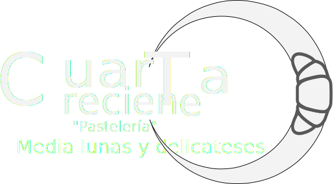
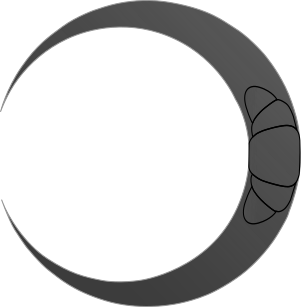

# Logos SVG

Logos en formato SVG, debido al tamaño, la no pérdida de calidad, su transparencia, útil no solamente para logossi no para múltiples propósitos.
 
 

 
 
 

---
---

[Siguiente **&#129042;**](/HTML/Media/webp/README.md "WEBP")

---
[*Volver* **&ldca;**](/HTML/README.md "Ir a Readme") [*Subir* **&#11165;**](# "Ir al título")